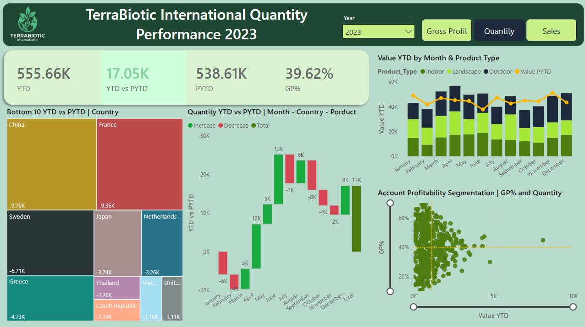
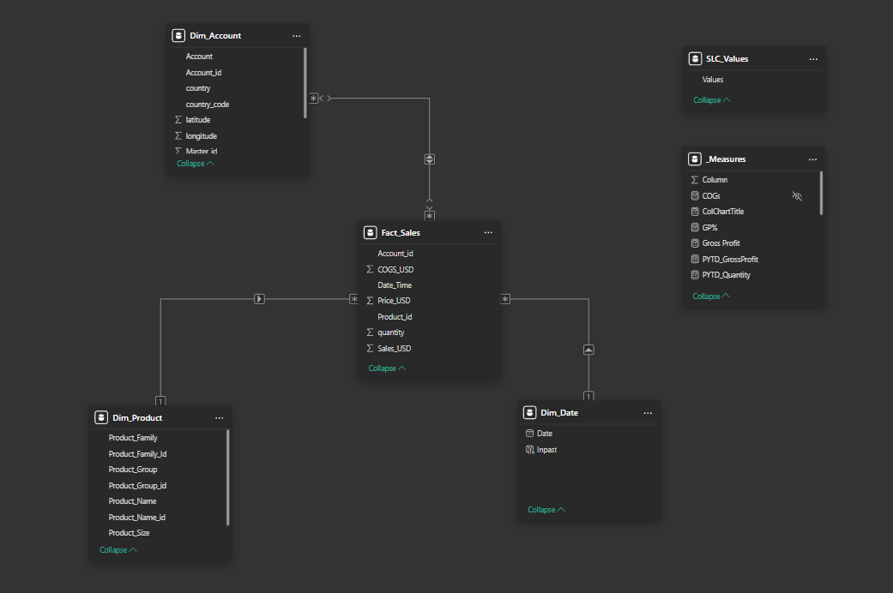

# 🌿 TerraBiotic International — Sales Performance Report
### *A Dynamic Power BI Portfolio Project | Business Intelligence & Data Analytics*

> **Note:** TerraBiotic International is a fictional company created for portfolio purposes.
> This project was developed as a **guided project** based on the excellent tutorial by **Mo Chen** on YouTube.
> Original dataset and project structure: [Mo Chen's GitHub](https://github.com/mochen862)
> While the foundation follows the guided walkthrough, this report reflects my own implementation, design decisions, and analytical interpretation.

---

## 📋 Table of Contents

- [Project Overview](#-project-overview)
- [Key Dashboards & Features](#-key-dashboards--features)
- [Data Model](#-data-model)
- [DAX Measures](#-key-dax-measures)
- [Technologies Used](#-technologies-used)
- [Key Business Insights](#-key-business-insights)
- [How to Use](#-how-to-use--interaction-guide)

---

## 🔍 Project Overview

**TerraBiotic International** is a fictional international plant distribution company operating across multiple countries and product categories. The logo was made with AI. This Power BI report was built to address a core business challenge:

> *"How can sales leadership quickly identify performance trends, underperforming markets, and high-value accounts, and act on them?"*

The report delivers a **condensed, dynamic performance dashboard** that enables data-driven decision-making by combining **Year-to-Date (YTD)** and **Prior Year-to-Date (PYTD)** comparisons across three key business metrics: **Sales**, **Gross Profit**, and **Quantity**.

Rather than static snapshots, the report is fully interactive — allowing users to pivot between metrics, filter by year, drill into specific months, countries, and accounts, and instantly surface where the business is growing or declining.

---

## 📊 Key Dashboards & Features

The report is a **single-page performance dashboard** containing six interconnected visuals, all driven by a central switch measure and responsive to the same slicers.



---

### 🏷️ Dynamic Report Title & Slicers
- **Report Title** — updates automatically based on the selected metric and year (e.g., *"TerraBiotic International | Quantity Performance 2023"*)
- **Metric Slicer** — toggle between **Gross Profit**, **Quantity**, and **Sales** — all visuals update instantly
- **Year Slicer** — filter the full report by fiscal year

---

### 📟 KPI Summary Cards
Four headline cards displayed at the top of the report:
- **YTD** — Year-to-Date value for the selected metric
- **YTD vs PYTD** — variance against the same period last year (highlighted in green/red)
- **PYTD** — Prior Year-to-Date value for comparison
- **GP%** — Overall Gross Profit percentage

---

### 🌍 Bottom 10 YTD vs PYTD | Country — Treemap
A treemap ranking the **10 worst-performing countries** by the variance between YTD and PYTD. Tile size and colour intensity reflect the magnitude of underperformance, allowing immediate identification of the most impacted markets.

---

### 📉 YTD vs PYTD by Month — Waterfall Chart
A waterfall chart breaking down the **month-by-month variance** between YTD and PYTD, with drill-down capability into Country and Product. Green bars indicate months that outperformed the prior year; red bars indicate underperformance. The final bar shows the cumulative total.

---

### 📦 Value YTD by Month & Product Type — Stacked Column + Line Chart
A stacked column chart showing **YTD value broken down by Product Type** (Indoor, Landscape, Outdoor) for each month, overlaid with a line representing the **PYTD value** for direct comparison. Enables quick identification of which product types are driving monthly performance.

---

### 🔵 Account Profitability Segmentation — Scatter Chart
A scatter chart plotting **GP%** (Y-axis) against **Value YTD** (X-axis) for each account. Reference lines mark the average GP% threshold, segmenting accounts into four quadrants — enabling targeted strategies for high-value, high-margin accounts versus those requiring profitability improvement.

---

## 🗃️ Data Model

The report is built on a clean **Star Schema** following Power BI best practices.





| Table | Type | Description |
|---|---|---|
| `fact_Sales` | Fact | Sales invoices — Quantity, Price, COGS, Date, Account ID, Product ID |
| `dim_Account` | Dimension | Account details — Country, Coordinates, Address |
| `dim_Product` | Dimension | Product hierarchy — Family, Group, Name, Size, Type |
| `dim_Date` | Dimension | Calculated date table with YTD/PYTD flags |
| `Slicer_Values` | Virtual | Drives the Switch Measure — Sales, Gross Profit, Quantity |
| `_Measures` | Virtual | Virtual table to create and sort measures, organized in folders, Base Measures, DynamicTitles, PYTD, SWITCH, YTD |

### Date Table
Built in DAX using `CALENDAR()`, covering 1 Jan 2022 to 31 Dec 2024. Includes a calculated `inPast` column (True/False) used to correctly scope PYTD calculations to only months with actual data — preventing empty future months from distorting prior-year comparisons.

---

## 🧮 Key DAX Measures

```dax
-- Base Measures
Sales        = SUM(fact_Sales[Sales_USD])
Quantity     = SUM(fact_Sales[Quantity])
Cost of Goods = SUM(fact_Sales[COGS_USD])
Gross Profit = [Sales] - [Cost of Goods]
GP %         = DIVIDE([Gross Profit], [Sales])

-- Time Intelligence
Sales YTD    = TOTALYTD([Sales], dim_Date[Date])
Sales PYTD   = CALCULATE([Sales],
                  SAMEPERIODLASTYEAR(dim_Date[Date]),
                  dim_Date[inPast] = TRUE)
YTD vs PYTD  = [Sales YTD] - [Sales PYTD]

-- Switch Measure (drives the entire report)
Selected Metric =
    SWITCH(
        SELECTEDVALUE(Slicer_Values[Values]),
        "Sales",        [Sales YTD],
        "Gross Profit", [Gross Profit YTD],
        "Quantity",     [Quantity YTD]
    )

-- Dynamic Titles
Report Title =
    "TerraBiotic International. | " &
    SELECTEDVALUE(Slicer_Values[Values]) &
    " Performance " &
    SELECTEDVALUE(dim_Date[Year])
```

---

## 🛠️ Technologies Used

| Tool | Purpose |
|---|---|
| **Power BI Desktop** | Report development, data modelling, DAX |
| **Power Query (M)** | Data ingestion, cleaning and transformation |
| **DAX** | Measures, calculated columns, time intelligence, switch logic |
| **Microsoft Excel** | Source data — fact table and dimension tables |
| **Power BI Service** | Publishing and sharing the report |

---

## 💡 Key Business Insights

Based on the 2024 YTD data analysed in the report:

- 📉 **Gross Profit declined significantly in March and April 2024** — Canada was identified as the primary contributor to this underperformance vs. PYTD.
- 🌿 **Landscape products** within the Canadian market showed the steepest decline — providing a clear, actionable signal for the sales team.
- 🌟 **February 2024 was the strongest month**, exceeding PYTD performance — an opportunity to study what drove that result and replicate it.
- 🎯 Several accounts show **above-average GP% but low sales volume** — representing high-priority growth opportunities where increased engagement could yield disproportionate profit gains.
- 🌍 **Canada, Colombia, Croatia, and Germany** consistently appear in the bottom 10 countries — suggesting these markets may require revised go-to-market strategies or pricing reviews.

---

## 🖱️ How to Use / Interaction Guide

The report is designed to be fully self-service. Here's how to navigate it:

1. **Select a Year** using the year slicer to set the YTD reference period.
2. **Switch between metrics** (Sales / Gross Profit / Quantity) using the slicer — all visuals update simultaneously.
3. **Click on a month** in the waterfall chart to filter the rest of the report to that specific month.
4. **Click on a country** in the bottom 10 chart to drill into which products and accounts are driving that country's performance.
5. **Use the scatter chart** to segment accounts by profitability — focus on the top-right quadrant (high GP%, growing sales) and investigate the bottom-right (high sales, low GP%).
6. **Drill down the product hierarchy** in the stacked column chart using the drill arrows: Product Family → Product Group → Product Name.

---

## 👤 Author

**João Felicíssimo**
Data Analyst | Power BI | SQL | Python
📍 Portugal
🔗 [LinkedIn](https://www.linkedin.com/in/joaofelicissimo07/) · [GitHub](https://github.com/JoaoFelicissimo03)

---
